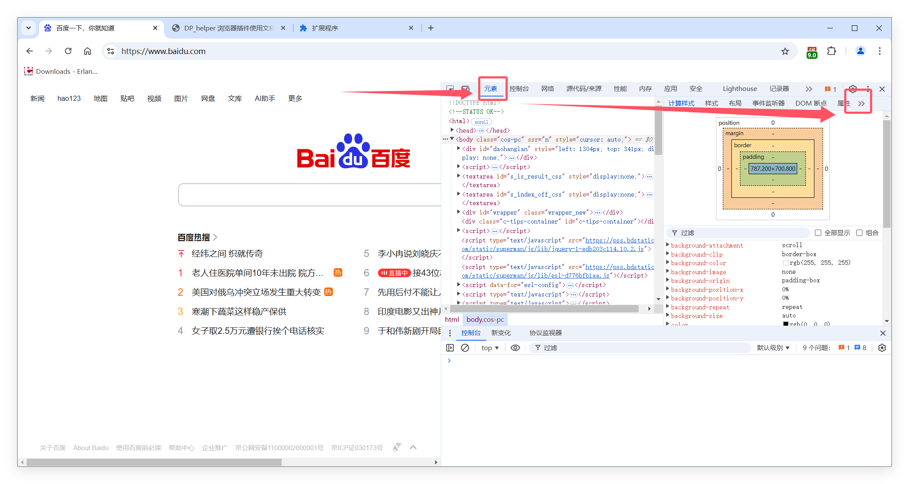
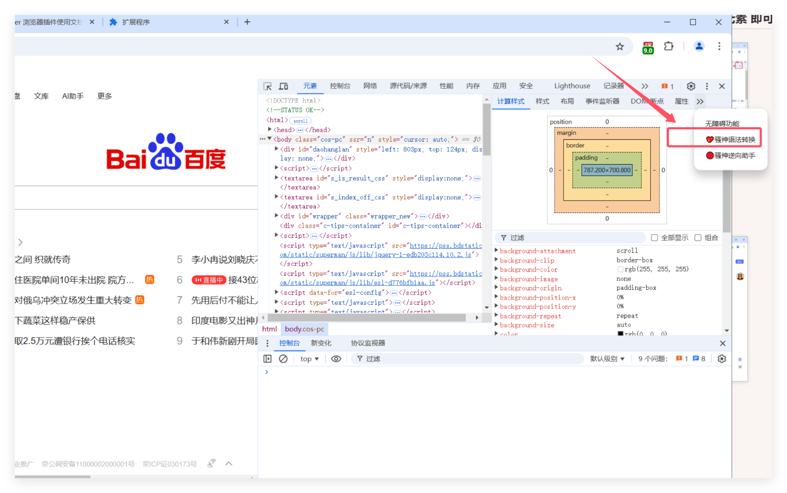
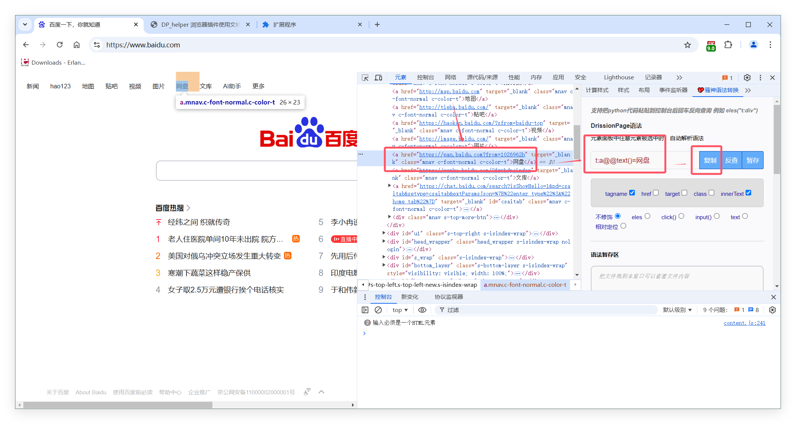
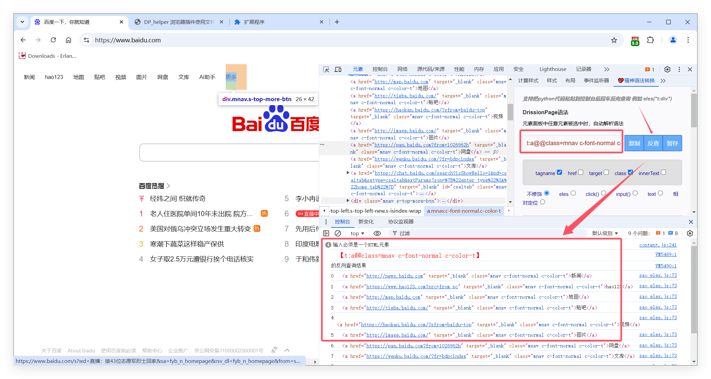
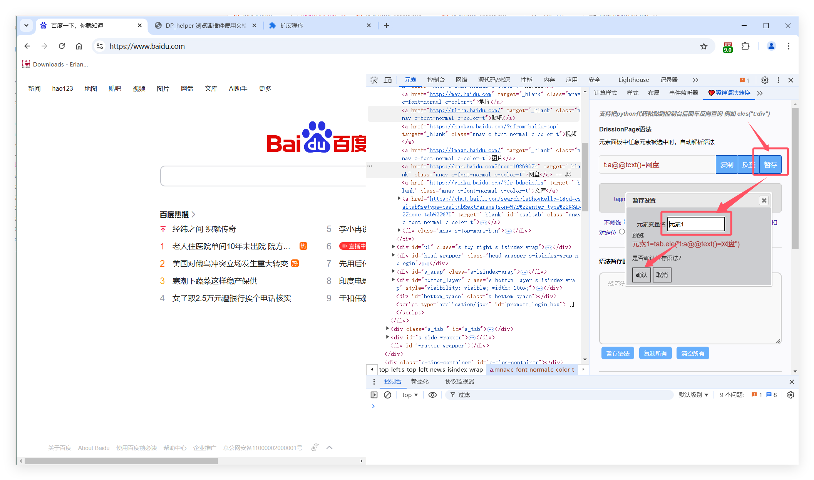
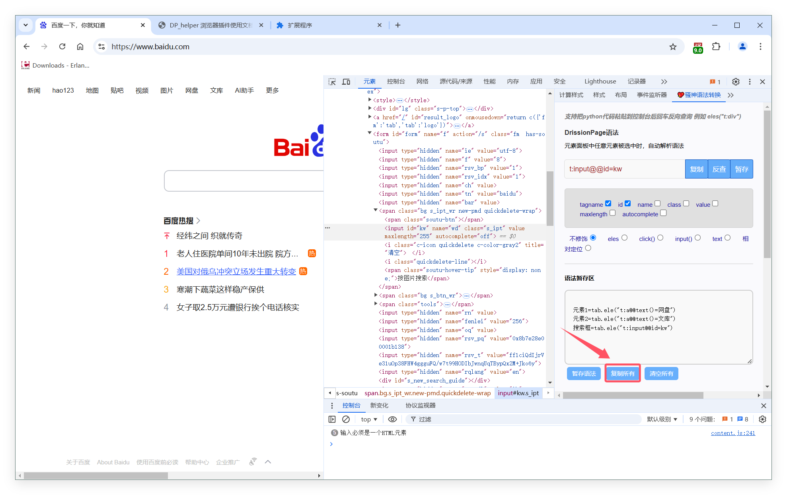

#  😈 高阶用法

## 打开
### 打开devtools  打开控制台  按F12  选择元素  即可使用

1.   

2.   

---
## 用法

####  👻 用法一 解析  
- 选中元素面板任意元素，自动生成语法
    
     
-  

---
#### 👻 用法二 反查 
-   点击 反查按钮  校验元素是否正确，是否有重复元素，是否有多个元素 
    
  
-  

---
#### 👻 用法三 暂存
-   点击 暂存按钮  可以把检查的元素保存起来，累计保存多个元素定位语法 ，最后批量获取整个页面所有所需元素的定位语法
    
    
-  
-  

